### Investigating Carbon Footprint of Recommender Systems Beyond Training Time  
Companion repository for the paper "Investigating Carbon Footprint of Recommender Systems Beyond Training Time" by  
*Josef Schodl*, *Oleg Lesota*, *Antonela Tommasel*, and *Markus Schedl*

accepted for the LBR track at RecSys 2025.

The environmental footprint of recommender systems has received growing attention in the research community. While recent work has examined the trade-off between model accuracy and the estimated carbon emissions during training, we argue that a comprehensive evaluation should also account for the emissions produced during inference time, especially in applications where models are deployed for extended periods with frequent inference cycles. In this study, we extend previous carbon footprint analyses from the literature by incorporating the inference phase into the carbon footprint assessment and exploring how variations in training configurations affect emissions. Our findings reveal that models with higher training emissions can, in some cases, offer lower environmental costs at inference time. Moreover, we show that minimizing the number of validation metrics computed during training can lead to significant reductions in overall carbon footprint, highlighting the importance of thoughtful experimental design in sustainable machine learning.

## Reference Work
Towards Sustainability-aware Recommender Systems: Analyzing the Trade-off Between Algorithms Performance and Carbon Footprint  
[https://dl.acm.org/doi/abs/10.1145/3604915.3608840](https://dl.acm.org/doi/abs/10.1145/3604915.3608840)  
[https://github.com/swapUniba/CarbonRecommenderRecSys23](https://github.com/swapUniba/CarbonRecommenderRecSys23)  

## Results Visualizations

In addition to our results table in the paper and raw results data provided in this repository, we created four types of visualizations per dataset to illustrate our findings.  

**Click on images to enlarge...**  

### Breakeven Matrices

The matrices show all possible training/inference trade-off combinations with the dataset.  
Interpretation: If algorithm A is preferred over algorithm B, then - after training both algorithms - how many inference queries does it take to consume the same total amount of energy for training and inference? For any larger number of inference queries between re-trainings, algorithm B would be the greener choice. Highlighted cells in red represent the three lowest numbers available for the dataset. The cell background color indicates an increase or drop of the nDCG score connected with the preference of algorithm A.  

| Mind | MovieLens | Amazon |
|:----:|:---------:|:------:|
| <a href="abstract/mind_breakeven_matrix.png">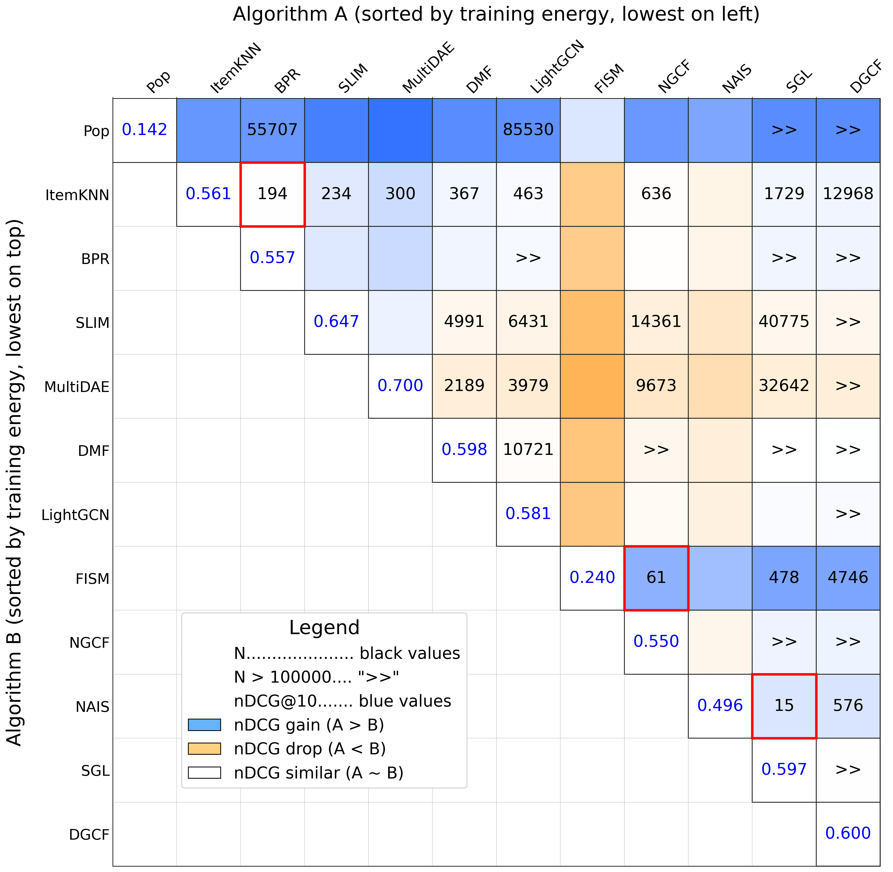</a> | <a href="abstract/movielens_breakeven_matrix.png">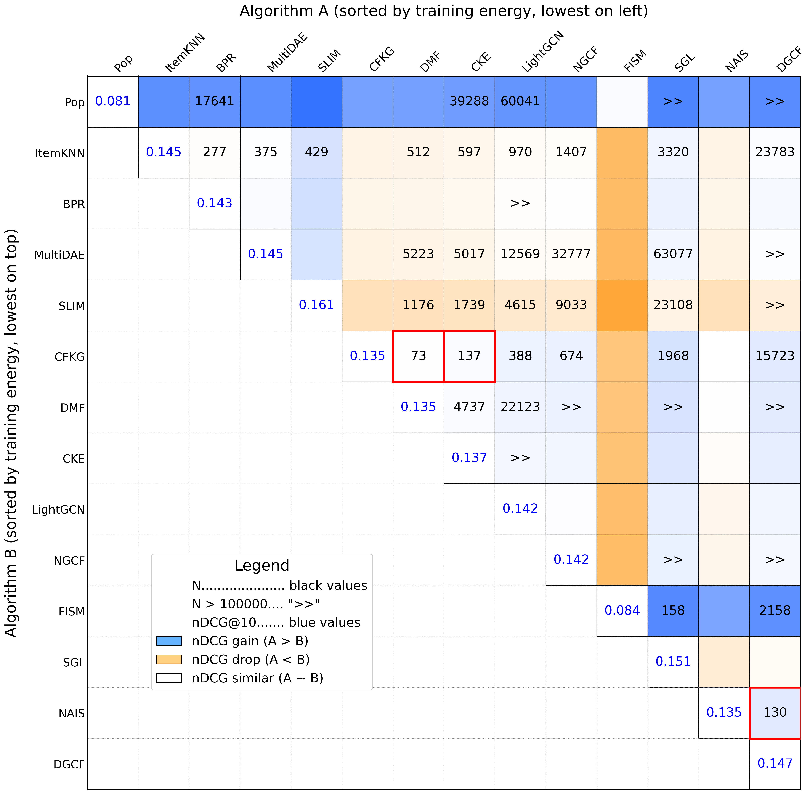</a> | <a href="abstract/amazon_breakeven_matrix.png">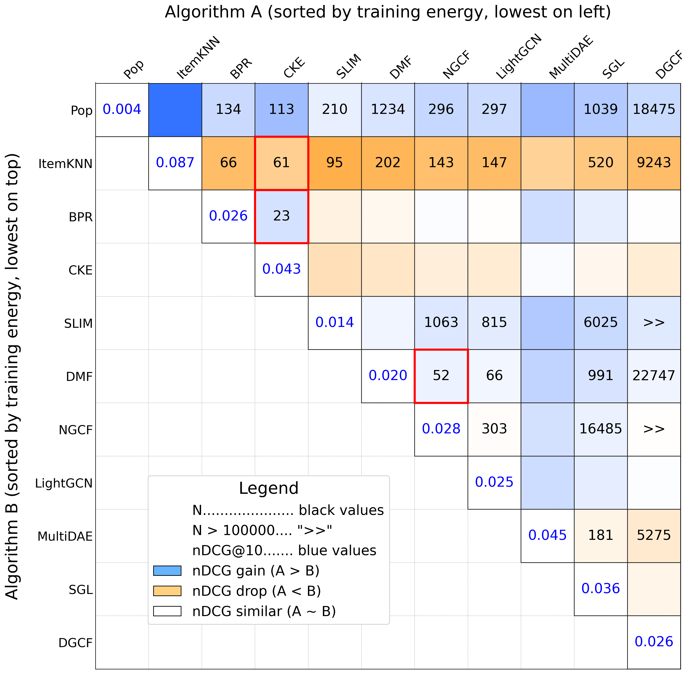</a> |

### Training Energy vs. nDCG Score

The scatter plots are showing energy consumed (x-axis) vs. nDCG score (y-axis) with the size of the dots representing the algorithms inference energy consumption.  

| Mind | MovieLens | Amazon |
|:----:|:---------:|:------:|
| <a href="abstract/mind_training_ndcg.png">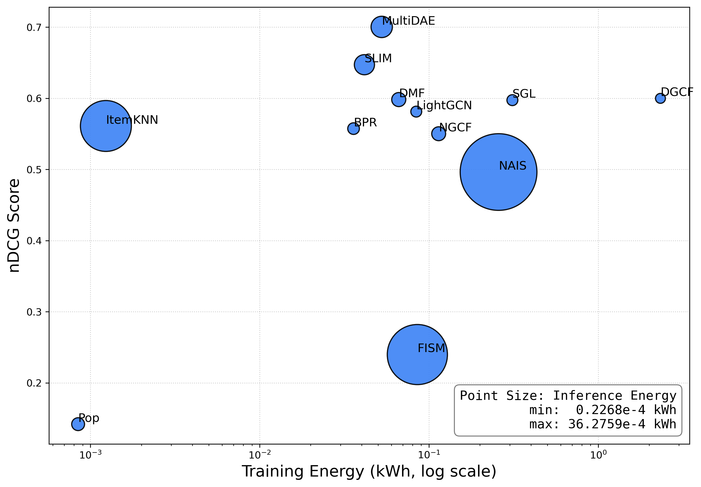</a> | <a href="abstract/movielens_training_ndcg.png">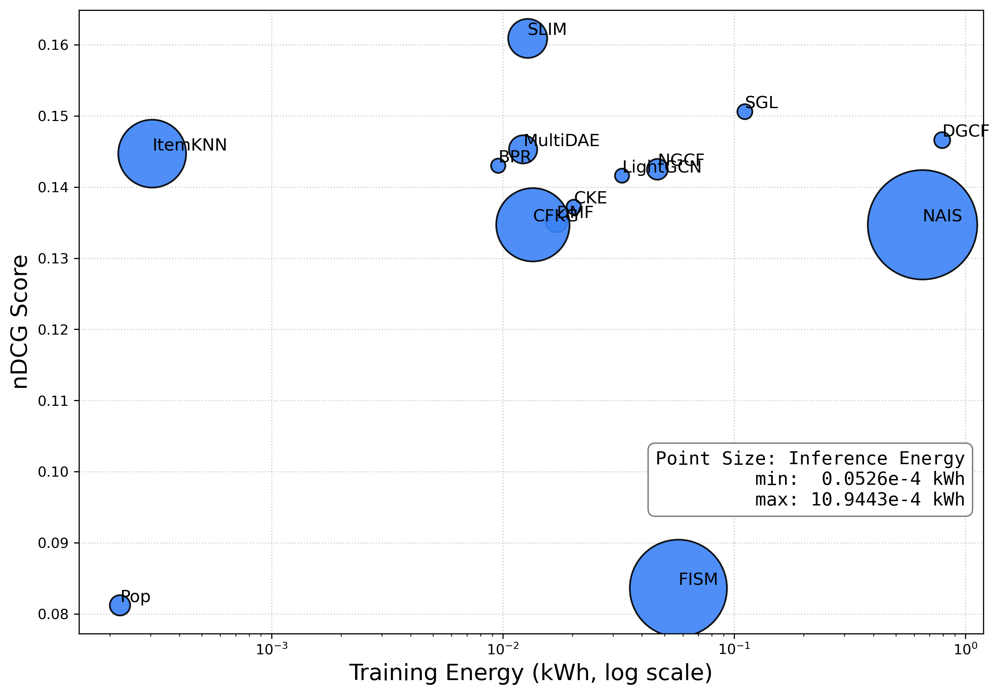</a> | <a href="abstract/amazon_training_ndcg.png">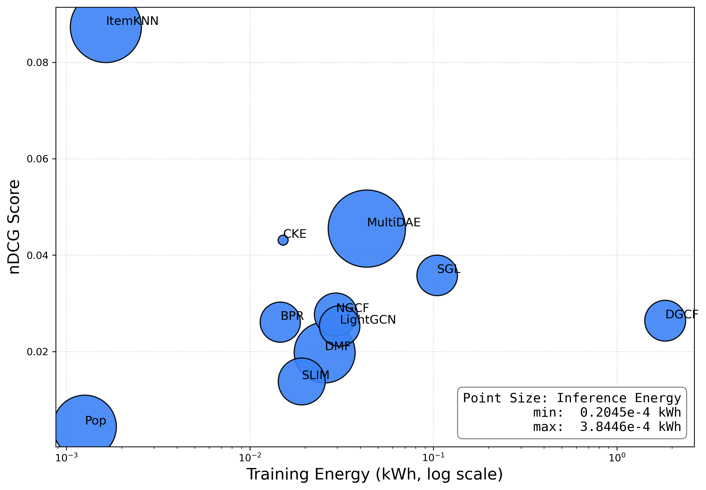</a> |

### Training Energy across Experiment Series

Line plots showing how each algorithm’s absolute training energy on dataset changes across the three setups: Reference, Reproduction, and One-Metric.

| Mind | MovieLens | Amazon |
|:----:|:---------:|:------:|
| <a href="abstract/mind_training_energy.png">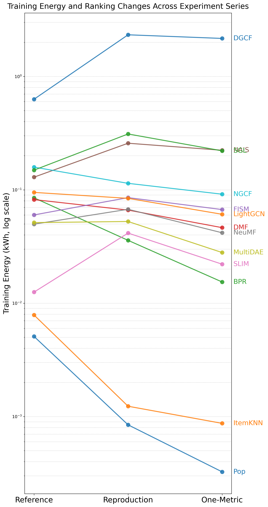</a> | <a href="abstract/movielens_training_energy.png">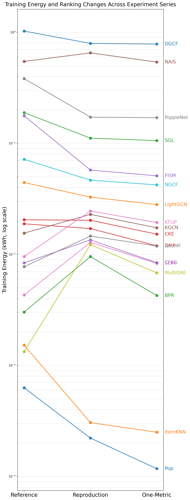</a> | <a href="abstract/amazon_training_energy.png">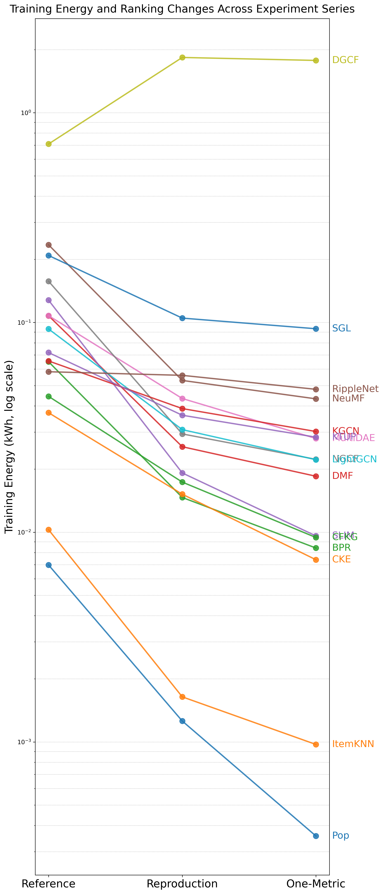</a> |

### Training Energy Heat-maps across Experiment Series

Heat-map of training energy comparing the original Reference, our Reproduction, and the One-Metric variant, with each cell annotated by the algorithm’s energy-efficiency rank (1 = greenest) in that setup.  

| Mind | MovieLens | Amazon |
|:----:|:---------:|:------:|
| <a href="abstract/mind_energy_heatmap.png">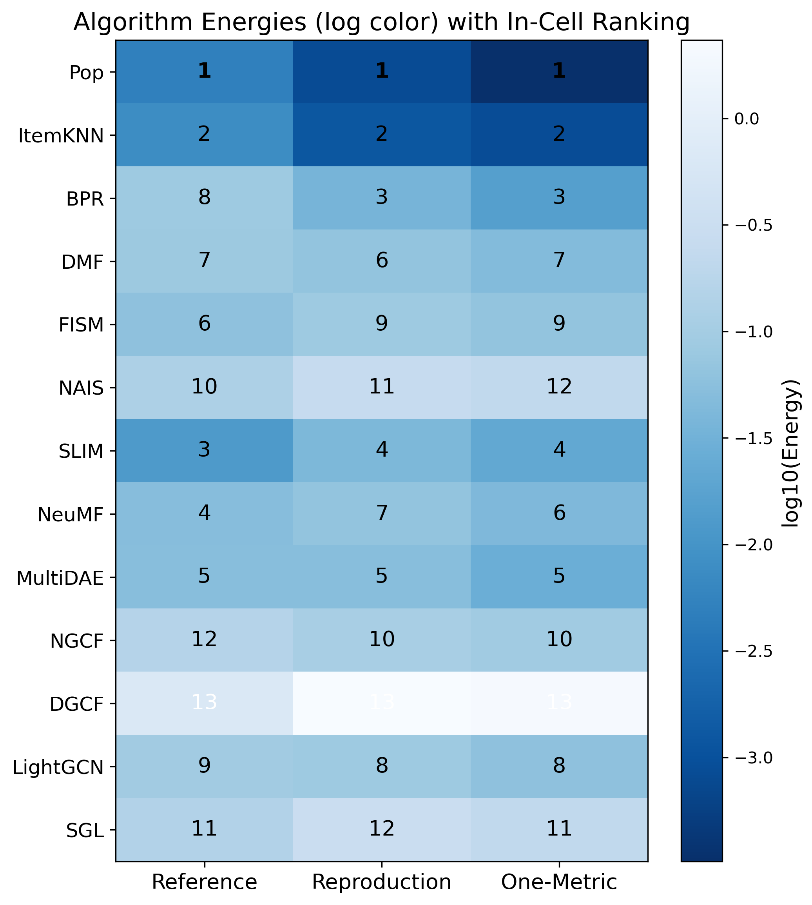</a> | <a href="abstract/movielens_energy_heatmap.png">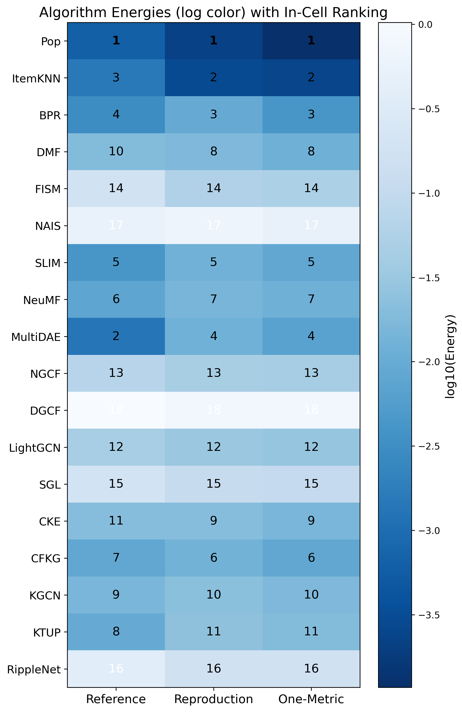</a> | <a href="abstract/amazon_energy_heatmap.png">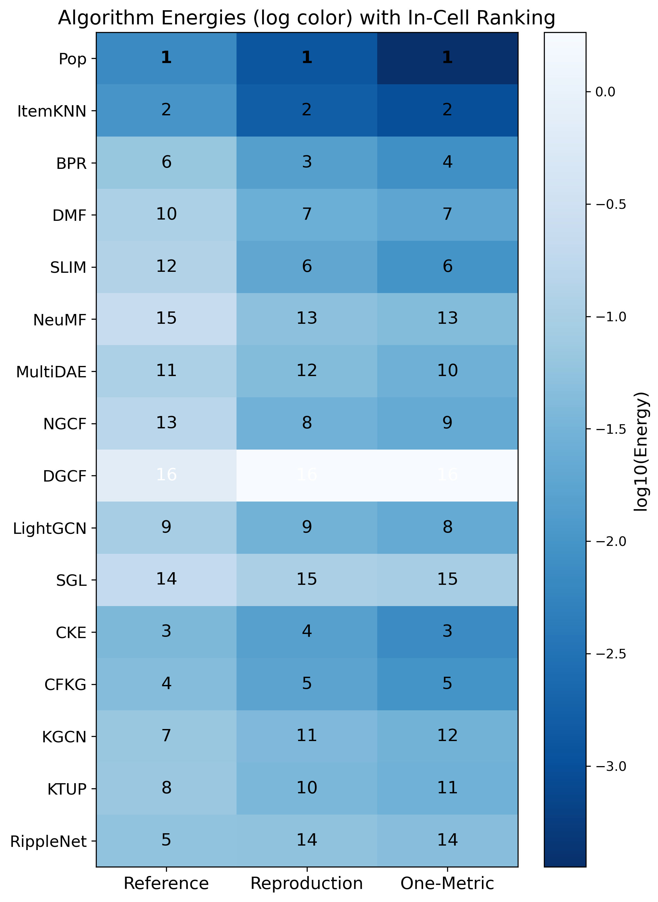</a> |

## Hardware and software stacks
Recommendation library used: [RecBole](https://recbole.io/) v1.1.1  
Energy consumption measurement library used: [CodeCarbon](https://codecarbon.io/) v2.8.3  
All experiments have been conducted on a mobile computer with Intel® CoreTM i7-10850H @ 2.70GHz CPU, 32GB RAM and a NVIDIA® Quadro T2000 mobile 4GB GPU, running Microsoft® Windows 11 Pro Version 24H2 with Anaconda Python 3.8.20, the full package environment can be found in `requirements.txt`.  
NOTE: We never tested our scripts on a computer without a GPU, hence we highly recommend to run them on computers with GPU support only.  

## Prerequisites for use of `reproduction.py`  

### Option A: Use our Docker image  
- We have created a [Docker](https://www.docker.com/) image on [Docker Hub](https://hub.docker.com/repositories/beyondtrainingtime) here: [https://hub.docker.com/r/beyondtrainingtime/recsys2025-beyond-training-time-gpu/](https://hub.docker.com/r/beyondtrainingtime/recsys2025-beyond-training-time-gpu/)  
- Make sure you have a working Docker setup on your computer to download the image using `docker pull beyondtrainingtime/recsys2025-beyond-training-time-gpu`  
- This will provide you with a ready-to-run Python environment that you can launch within your Docker environment.  
- You are ready to proceed to the instructions for experiment reproduction...  

### Option B: Create your local Python environment  

IMPORTANT: The interplay between Python packages can be fragile and although same version numbers in use even show different behaviors on different platforms. To minimize the risk of unexpected instabilities we **highly recommend the creation of a fresh Python environment** and override installation of locally cached package versions.  

We pinned the used RecBole version to 1.1.1 to align it with the Reference work. However, there is a [known RecBole issue](https://github.com/RUCAIBox/RecBole/issues/1499) (fixed in later versions) triggered by the unintended import of package `tkinter`, which results in an error on some configurations. The simplest workaround for this issue is to install `tkinter` manually, although it is not used by our code.  

- Clone or download our repository and set up a Python 3.8 environment according to `requirements.txt` or use conda to create one using `environment.yml` (we tested also on Python 3.10, but our measured experiments have all been conducted on Python 3.8).  
- Create a folder as your working directory and copy the `/dataset/` folder with its content and `reproduction.py` to your working directory.  
- Change to your working directory.  
- Copy `patch_recbole.py` and the `/patches/` folder to your working directory and run `patch_recbole.py` once. This will replace two scripts in the RecBole library.
- Make sure the `/saved/` folder with its subfolders exists within your working directory.  
- IMPORTANT: Contents of the `/log/` and `/results/` directories, together with `<dataset_name>_training_log.csv` and `<dataset_name>_training_emissions_log.csv` files represent the result and log files of our experiments. If you copy them to your working directory before conducting your own experiments, your results and logs will be added, respectively appended to these existing files, otherwise they will be created. Do not copy these files once you have run your own experiments, your results will be overwritten!  
- You are ready to proceed to the instructions for experiment reproduction...  

## Instructions for reproducing experiments using `reproduction.py`  
You can conduct training, evaluation and inference experiments by passing command line parameters to `reproduction.py`.
- `python reproduction.py -h` (or `--help`, or simply `?`) to show the available options.  
- `python reproduction.py train --dataset <dataset> --model <model> --metrics <metrics>` to run a model training experiment.  
- `python reproduction.py evaluate --dataset <dataset> --experiment <experiment>` to run a model evaluation experiment.  
- `python reproduction.py inference --dataset <dataset> --experiment <experiment>` to run a model inference experiment.  

### Parameters explained:  
<table>
  <tr>
    <th>Parameter</th>
    <th>Explanation</th>
  </tr>
  <tr>
    <td>`&lt;dataset&gt;`</td>
    <td>Must be one of "mind", "movielens" or "amazon".</td>
  </tr>
  <tr>
    <td>`&lt;model&gt;`</td>
    <td>Must be one of "Pop", "ItemKNN", "BPR", "DMF", "FISM", "NAIS", "SLIM", "NeuMF", "MultiDAE", "NGCF", "DGCF", "LightGCN", "SGL", "CKE", "CFKG", "KGCN", "KTUP" or "RippleNet". This represents the list of recommendation algorithms we used for our reproducibility study.</td>
  </tr>
  <tr>
    <td>`&lt;metrics&gt;`</td>
    <td>Must be one of "All" or "One". "All" will compute a set of 12 metrics (Recall, MRR, NDCG, Hit, MAP, Precision, GAUC, ItemCoverage, AveragePopularity, GiniIndex, ShannonEntropy and TailPercentage) after each training epoch. "One" will compute only MRR for training progress documentation.</td>
  </tr>
  <tr>
    <td>`&lt;experiment&gt;`</td>
    <td>Must be either an integer number corresponding to a training experiment number in `&lt;dataset_name&gt;_training_log.csv` or a string containing a model file name saved in `./saved/&lt;dataset&gt;/`. It may contain the relative path and/or extension, but does not have to.</td>
  </tr>
</table>

## Example usage of `reproduction.py`  
- `python reproduction.py train --dataset mind --model bpr --metrics all`  This will train a model using **BPR** on the **Mind** dataset and compute all 12 performance metrics.  
- `python reproduction.py evaluate --dataset amazon --experiment 22`  This will compute 12 performance metrics on the validation and test sets of the **Amazon** dataset and use the saved model from experiment number 22 as logged in `amazon_training_log.csv`.  
- `python reproduction.py evaluate --dataset movielens --experiment FISM-Apr-15-2025_21-33-27`  This will compute 12 performance metrics on the validation and test sets of the **MovieLens** dataset and use the saved model `./saved/movielens/FISM-Apr-15-2025_21-33-27.pth`.  
- `python reproduction.py inference --dataset mind --experiment 4`  This will query the Top-10 items for all valid users of the **Mind** dataset and use the saved model from experiment number 4 as logged in `mind_training_log.csv`.  
- `python reproduction.py inference --dataset amazon --experiment CKE-Apr-20-2025_01-32-33`  This will query the Top-10 items for all valid users of the **Amazon** dataset and use the saved model `./saved/amazon/CKE-Apr-20-2025_01-32-33.pth`.  

## Important notes  
- Depending on your computer and its CPU/GPU, RAM size and OS, you will most likely see a variance in results compared to ours, which is expectable because of the wide range of available products having very different power and efficiency characteristics.  
- You may encounter instabilities with some single dataset/model combinations, which is not unusual.  
- Depending on your GPU and its RAM size, you may encounter out-of-memory errors with some single experiments.  

## Directory structure and content of this repository

### 📁 `/`
**Description:**  
Code and main training experiments results.  

**Contents:**  
- `reproduction.py`: Python code to run training, inference and evaluation experiments. Follow instructions above to conduct experiments...  
- `<dataset_name>_training_log.csv`: Results of training experiments which are numbered for model reference used by inference experiments. Also contains all evaluated model performance metrics.  
- `<dataset_name>_training_emissions_log.csv`: Raw CodeCarbon logs for training experiments, containing energy related details. Our experiments have been conducted on a local computer, therefore data on Cloud Provider, Carbon Intensity (CI) and Power Utilization Efficiency (PUE) have not been used and are irrelevant.  
- `requirements.txt`: Full Python environment used, containing all package versions.  

### 📁 `/abstract/`
**Description:**  
Aggregated results and plots.  

**Contents:**  
- `RecSys_2025_Reproducibility_Investigating_Carbon_Footprint_of_Recommender_Systems.xlsx`: Aggregated high-level main results and comparisons data in MS-Excel format.  
- `<dataset_name>_breakeven_matrix.png`: A matrix showing all existing training/inference trade-offs for the dataset. Interpretation: If algorithm A is preferred over algorithm B, how many inference queries does it take after training both to consume the same total energy? And will nDCG increase or drop?  
- `<dataset_name>_training_ndcg.png`: A plot showing consumed training energy (x-axis) vs. nDCG score (y-axis) with point size representing inference energy.  
- `<dataset_name>_training_energy.png`: Line plot showing how each algorithm’s absolute training energy on dataset changes across the three setups: Reference, Reproduction, and One-Metric.  
- `<dataset_name>_energy_heatmap.png`: Heat-map of training energy comparing the original Reference, our Reproduction, and the One-Metric variant, with each cell annotated by the algorithm’s energy-efficiency rank (1 = greenest) in that setup.  

### 📁 `/dataset/`
**Description:**  
The datasets used for our experiments: **Mind** (News Ratings), **MovieLens** (Movie Ratings) and **Amazon Books** (Book Ratings). These datasets had been preprocessed within scope of the Reference Work and therefore been replicated from their [Github Repository](https://github.com/swapUniba/CarbonRecommenderRecSys23) in order to use identical versions.

### 📁 `/log/`
**Description:**  
Raw RecBole logs per recommendation algorithm for our experiments.  

### 📁 `/results/`
**Description:**  
Raw results from our Inference experiments, containing user lists, topk items and their scores, as well as CodeCarbon's energy related details.  

**Inference result filenames:**  
- example: `/results/movielens/2_3_2025-05-04-15-51-20.csv`
- 1st number references training experiment
- 2nd number references inference experiment
- remaining is timestamp
- example interpretation: dataset MovieLens, model used from MovieLens training experiment 2, inference experiment 3

**Inference footprint filenames:**  
- example: `/results/mind/inf_exp_8_emissions_log.csv`
- exp_<number> references training experiment
- example interpretation: dataset Mind, model used from Mind training experiment 8

### 📁 `/patches/`
**Description:**  
Contains two Python scripts to replace RecBole's `case_study.py` and `slimelastic.py` in order to fix bugs. Running `/patch_recbole.py` once after environment creation does this for you (not required within the Docker container as the files are already patched in the image).  

### 📁 `/saved/`
**Description:**  
Contains a subfolder for each dataset to hold your trained models and saved dataloaders (due to space limitations we unfortunately cannot provide our pretrained models). Do not delete, even if empty.  
